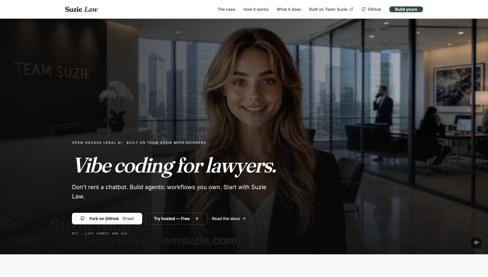
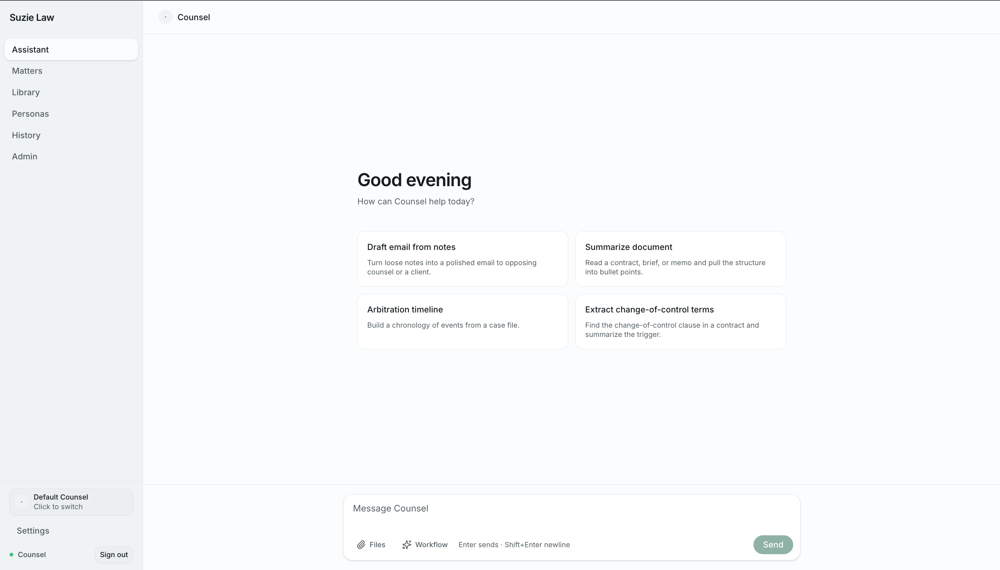
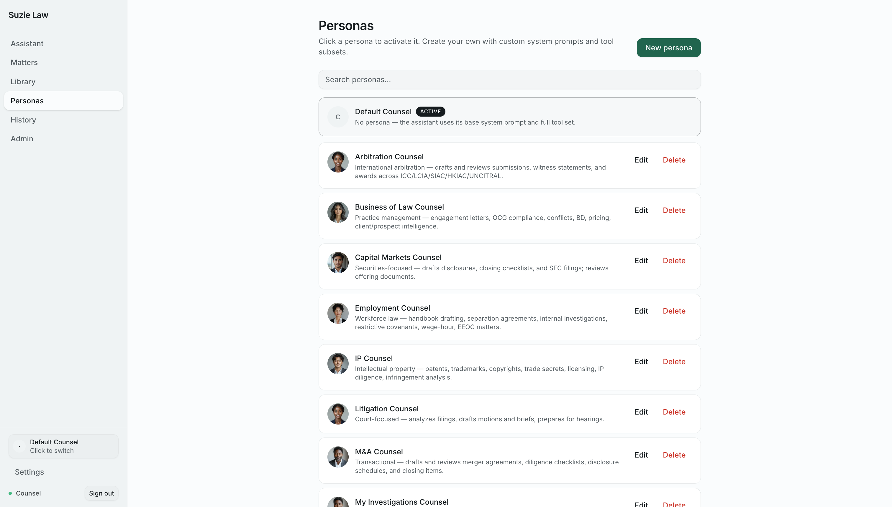
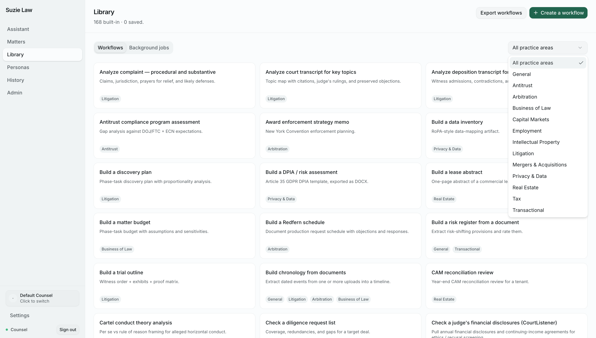
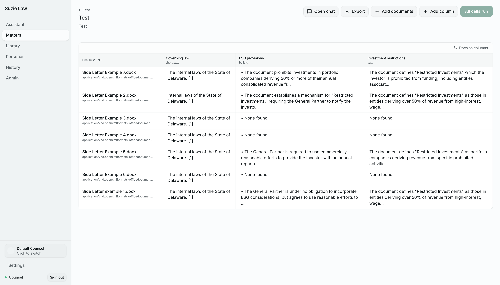
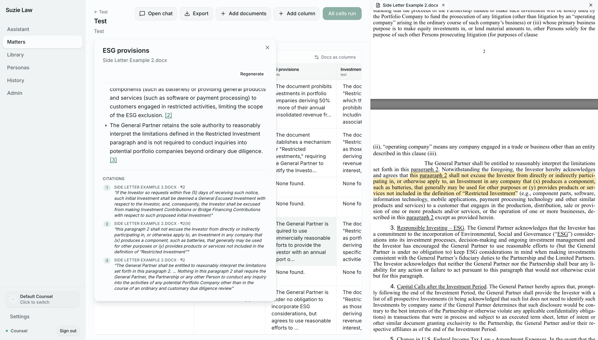
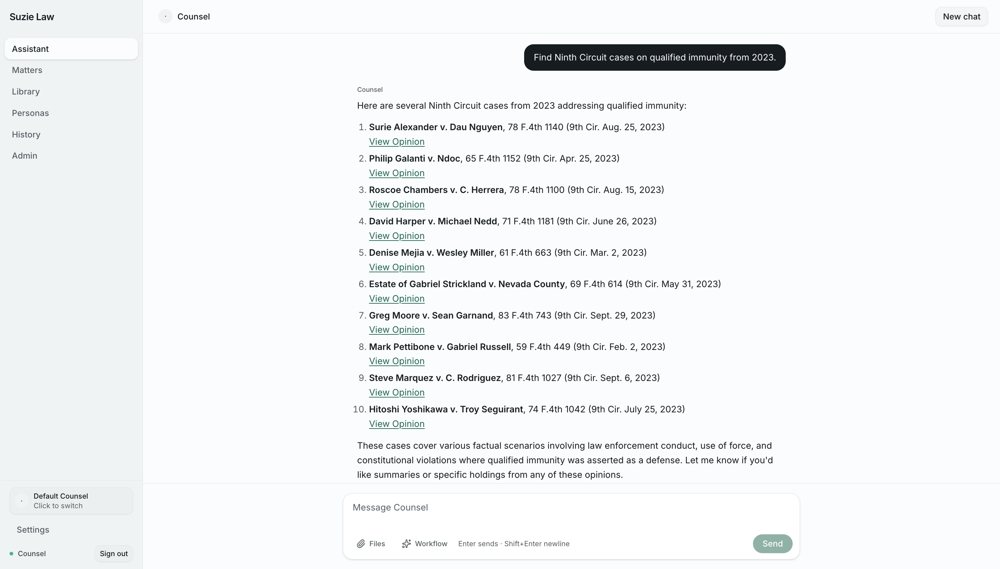
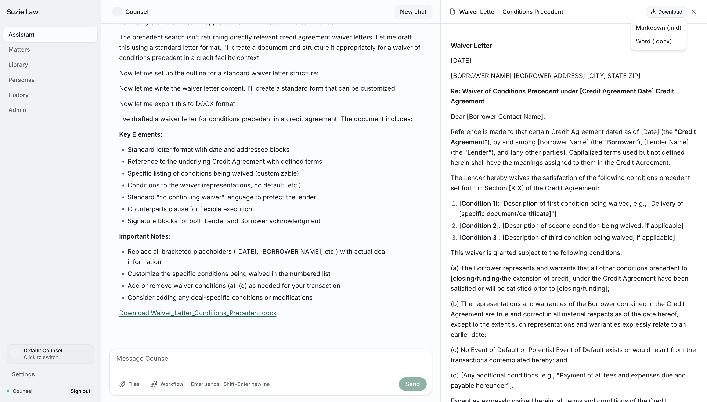
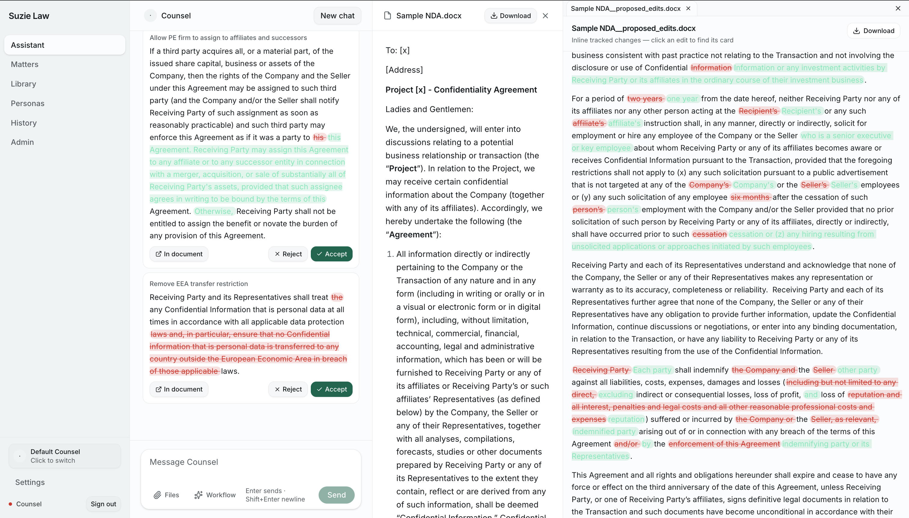
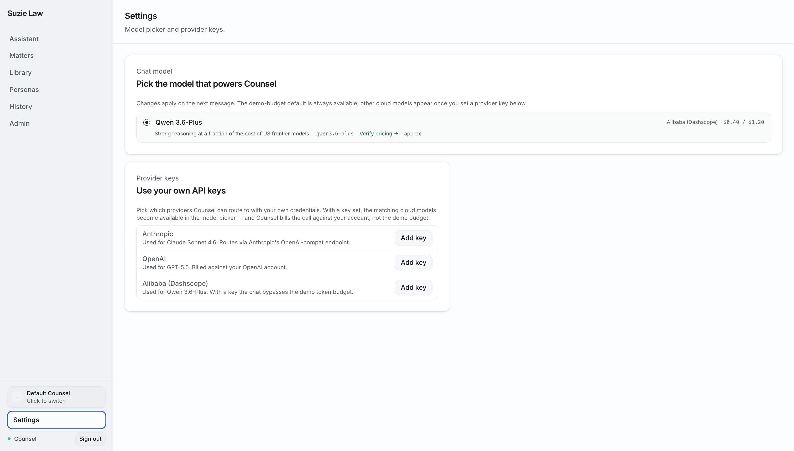

# Suzie Law

**An open-source alternative to Harvey.** A legal-AI workspace where lawyers chat with a specialized assistant ("Counsel"), upload contracts and filings, ask questions about them, draft memos that ship as `.docx`, search a personal knowledge base of indexed documents, and switch between practice-area personas tuned for litigation, M&A, capital markets, arbitration, IP, tax, and more.

Built on **[Team Suzie](https://github.com/firelex/open_teamsuzie)** — the open business operating layer for agent systems. Team Suzie provides the chat shell, agent loop, skills runtime, persona registry, knowledge-base store, document conversion service, and UI primitives. Suzie Law is a thin downstream app on top: legal-domain content, branding, and the legal-specific glue.

This repo is also the **canonical reference example** of the *"build your app in a sibling repo"* pattern Team Suzie's README describes — meaning we consume Team Suzie packages via local `link:` references rather than vendoring or re-implementing them.


**Demo video:** [docs/media/suzielaw-demo.mp4](docs/media/suzielaw-demo.mp4)

---

## A tour

A quick walk through the surfaces a lawyer actually touches.


**Vibe coding for lawyers.** The marketing site at [suzielaw.com](https://suzielaw.com) — open-source legal AI built on Team Suzie. Don't rent a chatbot; build agentic workflows you own.


**Counsel — the chat.** A clean composer with quick-start cards (draft email, summarise document, build a chronology, extract change-of-control). Files + Workflow buttons attach context inline; Counsel is the active persona, switchable from the sidebar.


**Personas — practice-area Counsels.** Twelve built-in personas (Arbitration, Business of Law, Capital Markets, Employment, IP, Litigation, M&A, Investigations, …) each with their own system prompt and tool subset. Click any to activate; create your own with the *New persona* button.


**Library — 160+ agentic workflows.** Recipes, not paste-and-pray prompts: *Analyze complaint*, *Antitrust compliance program assessment*, *DPIA / risk assessment*, *Build a discovery plan*, *Award enforcement strategy memo*, *Cartel conduct theory analysis*, judge financial-disclosure pulls, and more. Filter by practice area; click any tile to seed the chat.


**Matters — tabular review.** Drop a stack of documents into a matter and ask the same questions across all of them. Rows are documents, columns are questions; every cell is the agent's grounded answer. Add columns on the fly, export to spreadsheet, run only the pending cells.


**Sourcing — every claim is clickable.** Each answer carries inline citations to the underlying document. Click one and the source pane jumps to the highlighted passage — no fabricated authorities, no "trust me."


**Research — real US case law via CourtListener.** Ask for *"Ninth Circuit cases on qualified immunity from 2023"* and Counsel returns actual decisions with direct links to the opinion. Federal + state coverage; bring an API token to lift the rate limit.


**Drafting — live, with DOCX export.** Counsel proposes a TOC, fills section by section while keeping neighbouring sections coherent, and renders the draft live in a side panel. Download as Markdown or as a styled `.docx` that opens straight in Word.


**Markups — tracked-change redlines.** *"Redline this NDA from the buyer's perspective."* Counsel proposes per-clause edits as Accept / Reject cards in the chat; the side panel shows the proposed insertions and deletions inline; export a `.docx` with native Word tracked changes intact. Append-only version chain across upload → propose → accept/reject.


**Settings — BYOK, no lock-in.** Pick the model that powers Counsel (Claude, GPT, Qwen, or your own local server) and plug in your own provider keys. The key bypasses the demo budget and bills your account directly.

---

## Build your app this afternoon

The fastest way to use this repo is as a starting point for a vertical app of your own (legal or otherwise). Clone it, point your coding assistant at it, and describe what you want to build.

### 1. Install a coding assistant

You'll describe what you want in English; the assistant does the wiring. Pick one row:

| Assistant | Sign up for |
|---|---|
| [Claude Code](https://claude.com/claude-code) | A [Claude Pro/Max plan](https://claude.com/pricing) — flat monthly, recommended |
| [Codex](https://github.com/openai/codex) | A ChatGPT Plus/Pro plan or [OpenAI API key](https://platform.openai.com) |
| [OpenCode](https://opencode.ai) | An API key from any provider on [OpenRouter](https://openrouter.ai) |

### 2. Local prerequisites

- **Node 20** (pinned via `.nvmrc` — run `nvm use` after cloning). Switching Node versions after install requires a `better-sqlite3` rebuild — see Troubleshooting.
- **pnpm 9+**.
- **Python 3.10+** with `python3 -m venv` — required for the document conversion / DOCX export features.

### 3. Clone Team Suzie + Suzie Law side by side

```bash
mkdir -p ~/code && cd ~/code
git clone https://github.com/firelex/open_teamsuzie open_teamsuzie
git clone https://github.com/firelex/suzielaw
```

The two repos must sit as siblings. Suzie Law's `package.json` reaches into `../open_teamsuzie/packages/*` via pnpm `link:` references.

### 4. Configure + run

```bash
cd ~/code/suzielaw
nvm use               # picks up .nvmrc → Node 20
pnpm deps:build       # build the linked Team Suzie packages once
pnpm install

cp apps/suzielaw/.env.example apps/suzielaw/.env
# fill in SUZIELAW_AGENT_API_KEY in .env
# default model is Qwen 3.6-Plus via DashScope's OpenAI-compatible endpoint;
# swap SUZIELAW_AGENT_BASE_URL + SUZIELAW_MODEL together for another provider
# (SUZIELAW_MARKITDOWN_AGENT_BASE_URL=http://localhost:3013 is already
#  set — leave it as-is for full features)

pnpm dev:full
```

`pnpm dev:full` runs `scripts/dev-up.sh`, which:
- Starts **markitdown-agent** (Python conversion service) in the background. Creates the Python venv on first run, installs deps, starts on port 3013. Logs go to `.dev-logs/markitdown-agent.log`.
- Waits for the agent's `/health` to respond.
- Starts the **suzielaw** app (Express + Vite) in the foreground.
- Cleans up both on Ctrl+C.

Open <http://localhost:17502> and sign in with `demo@example.com` / `demo`.

**Chat-only run (no document tools)**: `pnpm dev` runs just the Node side. Faster start; the drafting / Q&A flows on documents won't work end-to-end without the Python service.

---

## What you get

Out of the box, Suzie Law has:

- **Counsel — a legal chat assistant.** Multi-page shell built on Team Suzie's `@teamsuzie/ui` primitives: Assistant / Library / Personas / (Knowledge Base, optional) / History / Settings.
- **Personas — 12 practice-area assistants.** Builtin file-based personas: Litigation, M&A, Capital Markets, Arbitration, Antitrust, Business of Law, Employment, IP, Privacy & Data, Real Estate, Tax, Transactional. Each has its own system prompt + tool subset + avatar. Users create their own private personas via the Personas page (CRUD scoped to their session).
- **Library — 160+ agentic prompt recipes** spanning all 13 practice areas (paginated 24/page). Every prompt is a tool-invoking recipe — not a paste-and-pray template. Document-summarization, clause extraction, drafting → DOCX export, transcript analysis, regulatory research, and more. Click any tile to pre-fill the chat. Save your own; export the catalog to CSV.
- **Document Q&A + drafting (DOCX).** Upload a DOCX / PDF / PPTX / XLSX / HTML / EPUB; the agent converts to markdown (DOCX via `mammoth + turndown` in-process for table fidelity, others via `markitdown-agent`) and answers with section-path citations. For drafting, Counsel proposes a TOC, fills section by section while reading neighbors for coherence, and exports a styled `.docx`. The draft renders live in a read-only artifact panel.
- **Knowledge Base (optional, RAG).** Drop documents into the Knowledge Base page; they're chunked, embedded via your agent's `/v1/embeddings` endpoint, and stored in `sqlite-vec` on the same SQLite file. The agent calls a `kb_search` tool when relevant. Enable with `SUZIELAW_KB_ENABLED=true`.
- **Case-law research via CourtListener.** 12 tools wired into the agent for federal case law, RECAP/PACER dockets, citation verification, judge profiles + financial disclosures, citation graphs, and circuit-split surveys. Works with or without an API token (auth bumps the rate limit).
- **Settings → model picker** with five options: three cloud (Claude Sonnet 4.6, GPT-5.5, Qwen 3.6-Plus) plus two locally-hosted (Qwen 3.6-35B-A3B and Gemma 4-26B-A4B-it via unsloth). Per-model routing — picking a Local model swaps the chat call to its own endpoint. Choice persists in localStorage and applies on the next message.
- **Local SQLite** for personas, user prompts, and the knowledge base — all in one file via `@teamsuzie/db-sqlite`. No external DB required.
- **Stub auth** — single demo user, signed-cookie session. Real multi-tenant auth means swapping in `@teamsuzie/shared-auth` (Postgres + Redis); the API contract is intentionally compatible.

### Optional features (off by default)

| Feature | Enable | Notes |
|---|---|---|
| Knowledge Base / RAG | `SUZIELAW_KB_ENABLED=true` + pick an embedding model | Defaults reuse the chat agent's base URL + key. Set `SUZIELAW_KB_EMBEDDING_MODEL` and `_DIM` per provider (e.g. `text-embedding-3-small` / `1536`). |
| CourtListener (authenticated) | `SUZIELAW_COURTLISTENER_TOKEN=...` | Free token at courtlistener.com/profile/api/. Tools work without it at lower rate limits. |
| Local models (Qwen / Gemma) | Stand up a vLLM/llama.cpp/unsloth server, set `SUZIELAW_LOCAL_QWEN_BASE_URL` and/or `_GEMMA_BASE_URL` | Default ports 8801 + 8802. The model picker routes to these endpoints when a Local row is selected. |
| MCP servers | Set `SUZIELAW_MCP_CONFIG=./mcp.json` | Standard Claude-Desktop-shape config. Loaded tools surface as `<server>__<tool>` in the agent. |

---

## What's where

```
~/code/
  open_teamsuzie/                          # platform — firelex/open_teamsuzie
    apps/agents/markitdown-agent/         # Python conversion service (DOCX/PDF ↔ markdown)
    apps/starters/starter-chat/           # generic chat starter (this app's ancestor)
    packages/ui/                          # shared component library (Personas, Settings cards, ModelPicker, etc.)
    packages/agent-loop/                  # OpenAI-compatible agent + tool-use loop, MCP client, per-model routing
    packages/markdown-document/           # MarkdownDocument + nav/draft tools + DOCX↔MD converter
    packages/personas/                    # File + SQLite persona registry + Express router + applyPersona helper
    packages/kb/                          # sqlite-vec knowledge base store + chunker + embedder + kb_search tool
    packages/skills/                      # Skill markdown registry (workflow + API skills)
    packages/db-sqlite/                   # SQLite plumbing
    packages/approvals/                   # human-in-the-loop approval queue
  suzielaw/                               # this repo
    apps/suzielaw/                        # Express + Vite app
      client/src/                         # React UI (consumes @teamsuzie/ui)
      client/src/data/                    # legal practice areas, models list, seed prompts
      client/src/pages/                   # Assistant, Library, Personas, KnowledgeBase, History, Settings
      personas/                           # Builtin <id>/PERSONA.md files (litigation, m-and-a, …)
      skills/                             # Workflow skill markdown (e.g. document-summarization)
      src/                                # Express backend, auth + chat + KB + persona endpoints
```

Legal-domain content lives in this repo. The chat shell, UI primitives, agent loop, doc tools, persona/KB runtimes, and conversion service — all upstream. **App-specific stays here; reusable goes upstream.** See `AGENTS.md` for the rule.

---

## Why a separate repo

Team Suzie's README has a section *"Building your app in a separate repo"* — Suzie Law is the canonical example. Improvements to the platform (chat shell, UI primitives, agent loop, document tools, persona/KB runtimes, conversion service) go upstream to `firelex/open_teamsuzie main`. Improvements to the legal product (practice areas, prompts, workflows, branding, builtin persona content) stay here.

In practice, that means most fixes that look like "the chat does X better" land upstream — and downstream simply pulls and rebuilds. Downstream commits tend to be feature-flagged content additions rather than UX rewrites.

---

## Troubleshooting

### `NODE_MODULE_VERSION` errors at startup

`@teamsuzie/db-sqlite` and `@teamsuzie/kb` use `better-sqlite3`'s native bindings, pinned to a Node ABI version. Switching Node versions after install (e.g. via `nvm`) breaks the binding with `NODE_MODULE_VERSION 137 vs 115` or similar. Rebuild against your active Node:

```bash
pnpm --dir ../open_teamsuzie rebuild -r
```

`.nvmrc` pins Node 20 in both repos, so this should rarely bite — usually only when someone bumps `.nvmrc` or the same checkout is opened with a different active Node.

### `markitdown-agent` import errors / missing modules

The venv must be active before running uvicorn. If activation isn't working, check `apps/agents/markitdown-agent/.venv/bin/activate` exists; if not, re-run `python3 -m venv .venv && pip install -r requirements.txt` in that directory. Or just run `pnpm dev:full` and let `scripts/dev-up.sh` handle setup.

### "Conversion failed: …" from the agent (non-DOCX uploads)

DOCX conversion runs in-process via `mammoth + turndown` and doesn't need the agent. For PDF/PPTX/XLSX/etc., conversion happens over HTTP to `markitdown-agent`. If the agent reports a failure:

1. Confirm `SUZIELAW_MARKITDOWN_AGENT_BASE_URL` is set in `apps/suzielaw/.env`.
2. `curl http://localhost:3013/health` should return `{"status":"ok",...}`.
3. The uploaded file shouldn't exceed `MARKITDOWN_AGENT_MAX_UPLOAD_BYTES` (default 50MB).

### "process is not defined" in the browser

Vite is bundling Node-only code into the client. Usually means an upstream package was reorganized and a previously-safe import now pulls in MCP/stdio. Clear the Vite optimize-deps cache:

```bash
rm -rf apps/suzielaw/client/node_modules/.vite
pnpm dev:full
```

If it persists after a fresh dev start, the offending package needs a subpath export — check `@teamsuzie/agent-loop`'s `package.json` `exports` map for the pattern (`./local-models` is a browser-safe data subpath; the root export pulls MCP).

### Knowledge Base: "Embedding dimension mismatch"

The `kb_chunk_vectors` virtual table is created with a fixed dim on first KB insert. If you change `SUZIELAW_KB_EMBEDDING_DIM` after that — or swap to a model with a different output dim — embeddings will be rejected. Either revert the dim, pick a model with the original dim, or wipe the KB tables (`DELETE FROM kb_documents; DELETE FROM kb_chunk_vectors;`) and start over.

---

## License

[MIT](LICENSE).
